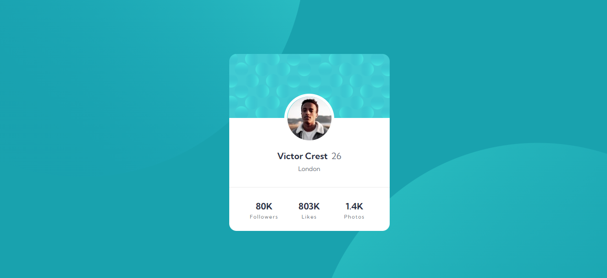
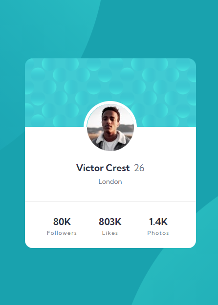

# Profile Card Component

## Table of contents

- [Overview](#overview)
  - [Challenge](#challenge)
  - [Screenshots](#screenshots)
  - [Links](#links)
- [My process](#my-process)
  - [Built with](#built-with)
  - [What I learned](#what-i-learned)
  - [Continued development](#continued-development)
  - [Useful resources](#useful-resources)
- [Author](#author)
- [Credits](#credits)

## Overview

### Challenge

### Screenshots

#### Desktop

#### Mobile

### Links

- [Github](https://github.com/OmKakatkar/profile-card-component)
- [Netlify](https://profile-card-component12.netlify.app/)

## My process

### Built with

- Mobile First
- Semantic HTML5 markup
- CSS custom properties
- Grid

### Continued development

It was first implementation of CSS Grids. I had to build a rough design on paper before actually coding. This helped me visualize the hierarchy

### Useful resources

#### Learn

- [CSS Grids - Kewin Powell](https://youtu.be/_lEkD8IGkwo)
- [CSS Grids - W3Schools](https://www.w3schools.com/css/css_grid.asp)

#### Font

- [Kumbh Sans](https://fonts.google.com/specimen/Kumbh+Sans)

#### Colors

| Colors                     |                              HSL Value                               |
| :------------------------- | :------------------------------------------------------------------: |
| Dark Cyan                  |  hsl(185, 75%, 39%) |
| Very Dark Desaturated Blue |  hsl(229, 23%, 23%) |
| Dark Grayish Blue          |  hsl(227, 10%, 46%) |
| Dark Gray                  |   hsl(0, 0%, 59%)   |

## Author

- [Website](https://omkakatkar-portfolio.netlify.app/)
- [Frontend Mentor Profile](https://www.frontendmentor.io/profile/OmKakatkar)
- [Twitter](https://twitter.com/omkakatkar)

## Credits

- [Frontend Mentor](https://www.frontendmentor.io/)
